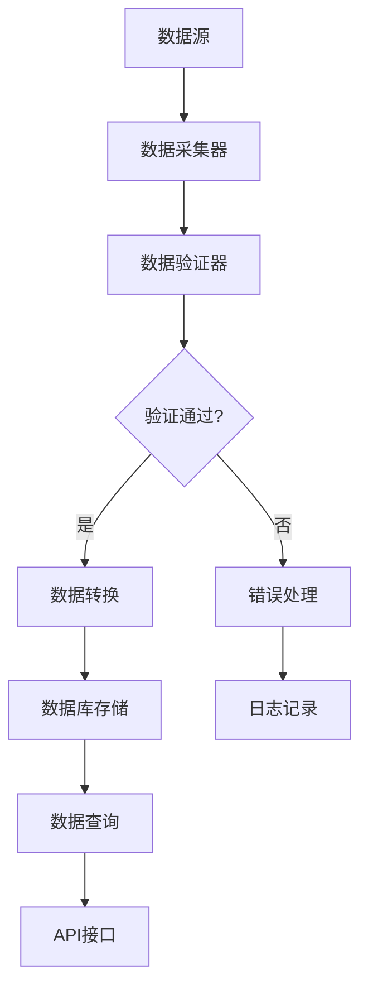

# 万得行业分类模块 - 工程化实现总结

## 项目概述

本模块实现了第一层万得行业分类的完整工程化解决方案，采用模块化、可扩展的架构设计，确保代码的可维护性、可测试性和可扩展性。

## 工程化设计原则

### 1. 分层架构设计
```
┌─────────────────────────────────────┐
│            API层 (main.py)          │  ← 用户接口
├─────────────────────────────────────┤
│          核心业务层 (core/)          │  ← 业务逻辑
├─────────────────────────────────────┤
│          数据模型层 (models/)        │  ← 数据结构
├─────────────────────────────────────┤
│          工具层 (utils/)             │  ← 基础设施
├─────────────────────────────────────┤
│          配置层 (config.py)          │  ← 配置管理
└─────────────────────────────────────┘
```

### 2. 单一职责原则
- **数据模型**: 只负责数据结构定义和验证
- **数据采集器**: 只负责从不同数据源获取数据
- **数据验证器**: 只负责数据质量验证
- **行业分类器**: 只负责核心业务逻辑
- **工具类**: 只负责通用功能（日志、数据库等）

### 3. 开闭原则
- 支持添加新的数据源（继承BaseDataCollector）
- 支持扩展验证规则（在DataValidator中添加方法）
- 支持自定义配置（在config.py中添加配置项）

## 核心组件详解

### 1. 数据模型层 (models/)

#### IndustryModel - 行业分类模型
```python
@dataclass
class IndustryModel:
    industry_code: str      # 行业代码
    industry_name: str      # 行业名称
    industry_level: int     # 行业层级
    parent_code: Optional[str]  # 父级行业代码
    # ... 其他字段
```

**特点:**
- 使用dataclass简化代码
- 内置数据验证逻辑
- 支持序列化/反序列化
- 提供业务方法（如层级关系判断）

#### StockIndustryModel - 股票行业映射模型
```python
@dataclass
class StockIndustryModel:
    stock_code: str         # 股票代码
    stock_name: str         # 股票名称
    industry_code: str      # 行业代码
    industry_name: str      # 行业名称
    confidence: float       # 映射置信度
    # ... 其他字段
```

**特点:**
- 支持置信度评估
- 提供置信度判断方法
- 完整的数据验证

### 2. 核心业务层 (core/)

#### DataCollector - 数据采集器
```python
class DataCollector:
    def __init__(self):
        self.collectors = {
            'wind': WindDataCollector(),
            'tushare': TushareDataCollector(),
            'akshare': AKShareDataCollector()
        }
```

**设计模式:**
- **策略模式**: 不同数据源使用不同的采集策略
- **工厂模式**: 根据配置创建相应的采集器
- **适配器模式**: 统一不同数据源的接口

#### DataValidator - 数据验证器
```python
class DataValidator:
    def validate_industry_data(self, industries: List[IndustryModel]) -> Tuple[bool, List[str]]:
        # 格式验证
        self._validate_industry_format(industries)
        # 逻辑验证
        self._validate_industry_logic(industries)
        # 完整性验证
        self._validate_industry_completeness(industries)
```

**验证策略:**
- **格式验证**: 检查数据格式的正确性
- **逻辑验证**: 验证业务逻辑的合理性
- **完整性验证**: 确保数据的完整性
- **一致性验证**: 检查不同数据源间的一致性

#### IndustryClassifier - 行业分类器
```python
class IndustryClassifier:
    def run_full_update(self) -> Dict[str, Any]:
        # 1. 初始化数据库
        # 2. 采集并验证数据
        # 3. 检查验证结果
        # 4. 保存数据到数据库
        # 5. 获取统计信息
```

**工作流程:**
- 完整的ETL流程
- 错误处理和回滚机制
- 详细的执行日志
- 统计信息生成

### 3. 工具层 (utils/)

#### Logger - 日志管理
```python
class Logger:
    def __init__(self, name: str = "industry_classification"):
        self._logger = self._setup_logger(name)
```

**特性:**
- 单例模式确保全局唯一
- 支持文件和控制台输出
- 自动创建日志目录
- 按日期分割日志文件

#### DatabaseManager - 数据库管理
```python
class DatabaseManager:
    @contextmanager
    def get_cursor(self):
        # 上下文管理器确保资源正确释放
```

**特性:**
- 连接池管理
- 事务支持
- 上下文管理器
- 异常处理和回滚

### 4. 配置层 (config.py)

```python
@dataclass
class DatabaseConfig:
    host: str = "localhost"
    port: int = 3306
    # ... 其他配置

class Config:
    def __init__(self):
        self.database = DatabaseConfig()
        self.wind = WindConfig()
        # ... 其他配置
        self._load_from_env()  # 从环境变量加载
```

**配置管理:**
- 分层配置结构
- 环境变量支持
- 默认值设置
- 类型安全

## 工程化特性

### 1. 可维护性
- **清晰的代码结构**: 按功能模块组织代码
- **详细的文档**: 每个类和方法都有文档字符串
- **统一的编码规范**: 遵循PEP 8规范
- **模块化设计**: 低耦合、高内聚

### 2. 可测试性
- **单元测试**: 每个组件都有对应的测试
- **模拟数据**: 提供模拟数据用于测试
- **依赖注入**: 便于测试时替换依赖
- **错误处理**: 完整的异常处理机制

### 3. 可扩展性
- **插件化架构**: 易于添加新的数据源
- **配置驱动**: 通过配置控制行为
- **接口标准化**: 统一的接口定义
- **版本兼容**: 向后兼容的设计

### 4. 可部署性
- **依赖管理**: requirements.txt管理依赖
- **环境配置**: 支持不同环境的配置
- **日志记录**: 完整的操作日志
- **错误监控**: 异常捕获和报告

## 数据流程



## 质量保证

### 1. 代码质量
- **类型注解**: 完整的类型提示
- **代码检查**: 使用flake8等工具
- **格式化**: 使用black等工具
- **文档生成**: 自动生成API文档

### 2. 数据质量
- **多级验证**: 格式、逻辑、完整性验证
- **一致性检查**: 跨数据源的一致性验证
- **质量指标**: 覆盖率、准确率等指标
- **监控告警**: 数据质量异常告警

### 3. 性能优化
- **连接池**: 数据库连接复用
- **缓存机制**: 减少重复计算
- **批量操作**: 提高数据库操作效率
- **异步处理**: 支持异步数据采集

## 部署和使用

### 1. 环境准备
```bash
# 创建虚拟环境
python -m venv venv
source venv/bin/activate

# 安装依赖
pip install -r requirements.txt
```

### 2. 配置设置
```bash
# 创建配置文件
cp .env.example .env
# 编辑配置文件
vim .env
```

### 3. 运行程序
```bash
# 初始化数据库
python main.py --action init

# 更新数据
python main.py --action update

# 查询数据
python main.py --action query --level 1
```

## 监控和维护

### 1. 日志监控
- **操作日志**: 记录所有操作
- **错误日志**: 记录异常信息
- **性能日志**: 记录执行时间
- **访问日志**: 记录API调用

### 2. 数据监控
- **数据量监控**: 监控数据增长
- **质量监控**: 监控数据质量指标
- **更新监控**: 监控数据更新频率
- **异常监控**: 监控异常数据

### 3. 系统监控
- **资源监控**: CPU、内存、磁盘使用
- **网络监控**: 网络连接状态
- **服务监控**: 服务可用性
- **性能监控**: 响应时间等

## 总结

本模块通过工程化的设计，实现了：

1. **模块化架构**: 清晰的层次结构和职责分离
2. **可扩展设计**: 支持添加新的数据源和功能
3. **质量保证**: 完整的数据验证和错误处理
4. **易于维护**: 清晰的代码结构和详细文档
5. **生产就绪**: 完整的部署和监控方案

这种设计确保了模块的长期可维护性和可扩展性，为整个大势所趋风险框架提供了稳定可靠的行业分类基础。 